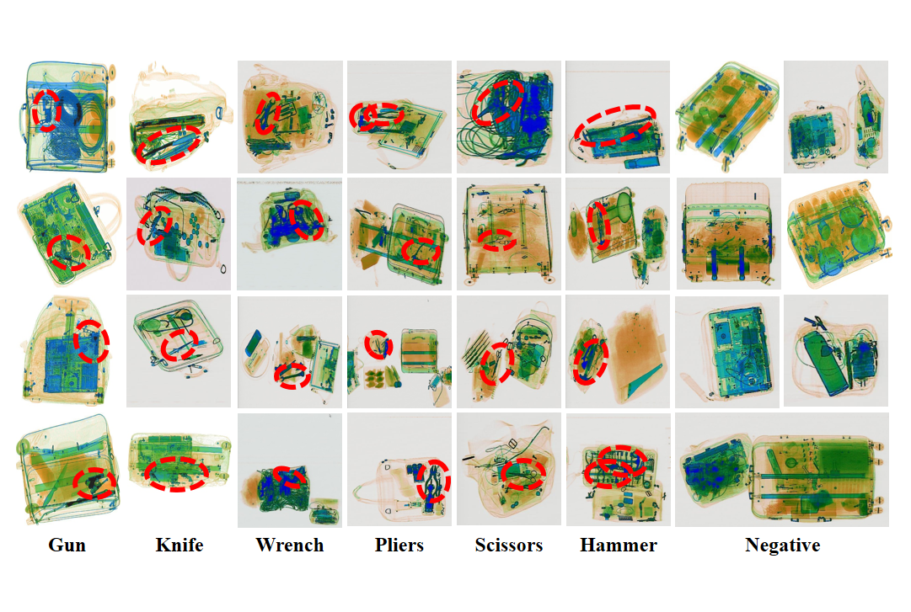

# SIXray：A Large-scale Security Inspection X-ray Benchmark for  Prohibited Item Discovery in Overlapping Images
## INTRODUCTION
The SIXray dataset is constructed by Pattern Recognition and Intelligent System Development Laboratory, University of Chinese Academy of Sciences.

The SIXray dataset contains 1,059,231 X-ray images which are collected from some several subway stations. There are six common categories of prohibited items, namely, gun, knife, wrench, pliers, scissors and hammer.
To study the impact brought by training data imbalance, we construct three subsets of this dataset, and name them as SIXray10, SIXray100 and SIXray1000
On the entire dataset, we use the image-level annotations provided by human security inspectors. In addition, on the testing sets, we manually add a bounding-box for each prohibited item to evaluate the performance of object localization.
## LICENSE
*  The images and the corresponding annotation results for download are part of UCAS SIXray dataset.
* The images and the corresponding annotation results can only be used for ACADEMIC PURPOSES. NO COMERCIAL USE is allowed
*  Copyright © Pattern Recognition and Intelligent System Development Laboratory, University of Chinese Academy of Sciences (UCAS-PRISDL). All rights reserved.
## DOWNLOAD
You can download all the dataset from [here](https://pan.baidu.com/s/1zSbpapRURc9Uzjl-1ZWI_w)

